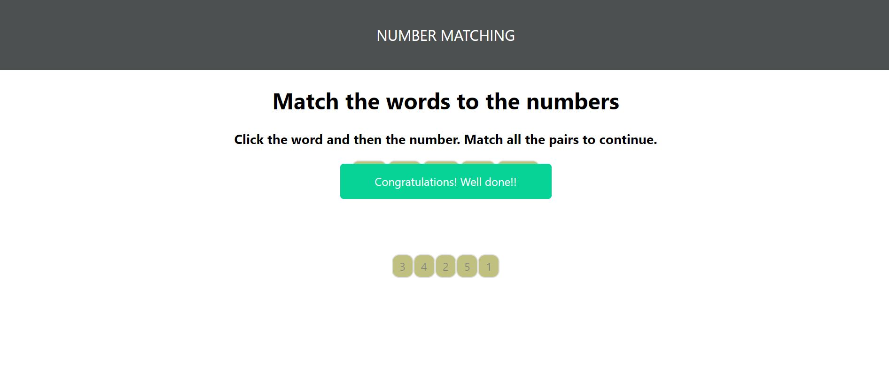

# Number matching

This is app allows you to match words of numbers like(one, two, there) with thier equivalent numeric symbol(1,2,3). On succesful match it displays `Congratulations! well done!!` message.



### Libraries Used

```
HTML
```

```
CSS
```

```
JavaScript ES6
```

```
React
```

### Future improvements

I will keep working on this project and expand it to match pictures with thier names. I will also try to build this app in Vue.js as I am trying to learn Vue at the moment.

### Project setup

```
npm install
```

### Compiles and hot-reloads for development

```
npm start
```

### Compiles and minifies for production

```
npm run build
```

### Run your tests

```
npm run test
```

### Lints and fixes files

```
npm run lint
```

### License

.MIT

### Author

Awet
